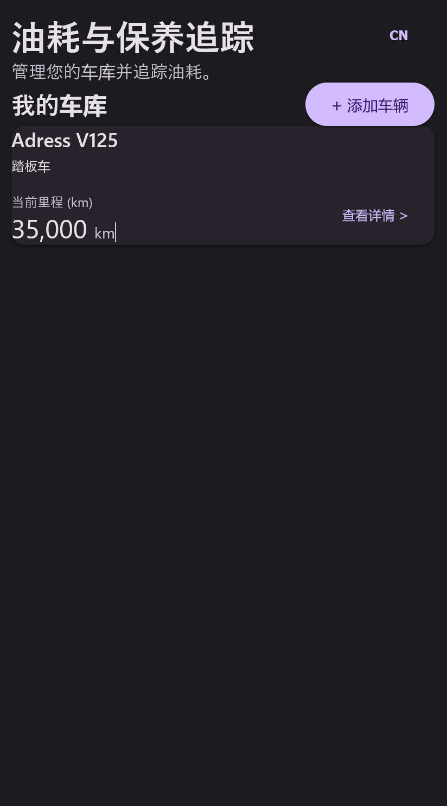
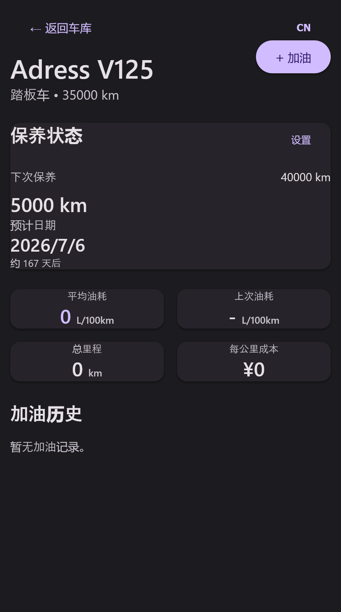
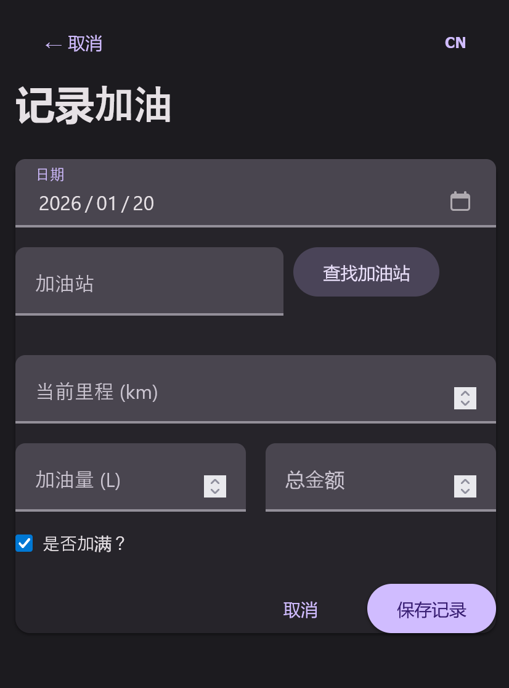

# 🚗 燃油与保养追踪器 (Fuel & Maintenance Tracker)

[English](README_EN.md) | [日本語](README_JA.md) | [中文](README.md)

一个现代化的 Web 应用程序，用于管理您的车辆、追踪燃油消耗以及预测保养需求。

## 📸 应用截图

<p align="center">
  
  
  
</p>

## ✨ 主要功能

*   **多车辆管理**：支持添加多辆车，涵盖汽车、摩托车和三轮车等多种类型。
*   **燃油记录**：轻松记录加油详情（里程、升数、价格、是否加满）。
*   **智能统计**：自动计算平均油耗 (L/100km)、每公里成本和总行驶里程。
*   **保养预测**：基于您的驾驶习惯，智能预测下一次保养日期。
*   **加油站查找**：集成地图功能，快速查找附近的加油站。
*   **多语言支持**：原生支持中文、日语和英语。
*   **移动端适配**：响应式设计，完美适配手机和桌面设备 (Material Design 3)。

## 🛠️ 技术栈

*   **框架**: [Next.js 16](https://nextjs.org/) (App Router)
*   **数据库**: [Prisma](https://www.prisma.io/) (SQLite)
*   **样式**: [TailwindCSS](https://tailwindcss.com/) + CSS Modules (Material Design 3 风格)
*   **地图**: [Leaflet](https://leafletjs.com/) + OpenStreetMap
*   **部署**: Docker 支持

## 🚀 快速开始

### 本地开发

1.  **克隆仓库**
    ```bash
    git clone https://github.com/yourusername/fuel-maintenance-tracker.git
    cd fuel-maintenance-tracker
    ```

2.  **安装依赖**
    ```bash
    npm install
    ```

3.  **初始化数据库**
    ```bash
    npx prisma migrate dev
    ```

4.  **启动开发服务器**
    ```bash
    npm run dev
    ```
    访问 `http://localhost:3000`。

### 🐳 Docker 部署

我们提供了详细的 [Docker 部署指南](DEPLOY.md)。

简易命令：

```bash
docker build -t fuel-tracker .
docker run -d -p 9521:9521 -v ./data:/app/prisma/db fuel-tracker
```

## 📂 项目结构

```
src/
├── app/              # Next.js App Router 页面
├── components/       # React UI 组件
├── lib/              # 工具函数 (计算逻辑, 数据库, i18n)
└── ...
```

## 🤝 贡献

欢迎提交 Pull Request 或 Issue！

## 📄 许可证

MIT License
