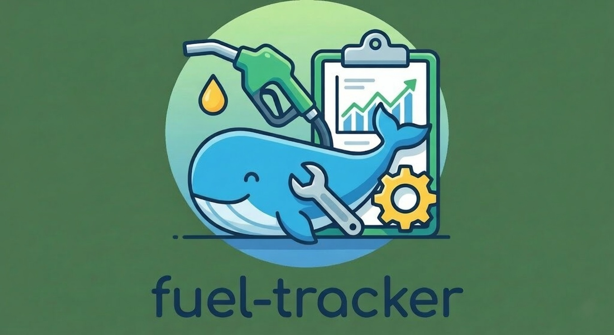

# 🚗 燃費・メンテナンス・トラッカー (Fuel & Maintenance Tracker)

[中文](README.md) | [日本語](README_JA.md) | [English](README_EN.md)

<p align="center">
  
</p>

車両の管理、燃費の追跡、およびメンテナンス時期の予測を行うためのモダンなWebアプリケーションです。

## 📸 アプリのスクリーンショット

<p align="center">
  
  
  
</p>

## ✨ 主な機能

*   **複数車両管理**: 自動車、バイク、三輪車など、複数の車両を登録・管理できます。
*   **給油記録**: 給油の詳細（走行距離、リッター数、価格、満タンかどうか）を簡単に記録できます。
*   **スマート統計**: 平均燃費 (L/100km)、kmあたりのコスト、総走行距離を自動計算します。
*   **メンテナンス予測**: あなたの運転習慣に基づいて、次回のサービス日を予測します。
*   **ガソリンスタンド検索**: 統合された地図機能で、近くのガソリンスタンドを素早く見つけられます。
*   **多言語対応**: 日本語、中国語、英語にネイティブ対応しています。
*   **モバイル対応**: レスポンシブデザインにより、スマートフォンとデスクトップの両方で快適に利用できます (Material Design 3)。

## 🛠️ 技術スタック

*   **フレームワーク**: [Next.js 16](https://nextjs.org/) (App Router)
*   **データベース**: [Prisma](https://www.prisma.io/) (SQLite)
*   **スタイル**: [TailwindCSS](https://tailwindcss.com/) + CSS Modules (Material Design 3 スタイル)
*   **地図**: [Leaflet](https://leafletjs.com/) + OpenStreetMap
*   **デプロイ**: Docker 対応

## 🚀 クイックスタート

### ローカル開発

1.  **リポジトリのクローン**
    ```bash
    git clone https://github.com/yourusername/fuel-maintenance-tracker.git
    cd fuel-maintenance-tracker
    ```

2.  **依存関係のインストール**
    ```bash
    npm install
    ```

3.  **データベースの初期化**
    ```bash
    npx prisma migrate dev
    ```

4.  **開発サーバーの起動**
    ```bash
    npm run dev
    ```
    `http://localhost:3000` にアクセスしてください。

### 🐳 Docker デプロイ

詳細な [Docker デプロイメントガイド (英語/中国語)](DEPLOY.md) をご用意しています。

簡易コマンド:

```bash
docker build -t fuel-tracker .
docker run -d -p 9521:9521 -v ./data:/app/prisma/db fuel-tracker
```

## 📂 プロジェクト構造

```
src/
├── app/              # Next.js App Router ページ
├── components/       # React UI コンポーネント
├── lib/              # ユーティリティ (計算ロジック, DB, i18n)
└── ...
```

## 🤝 貢献

プルリクエストや Issue の報告は大歓迎です！

## 📄 ライセンス

MIT License
